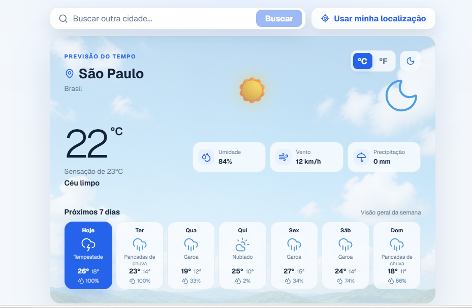
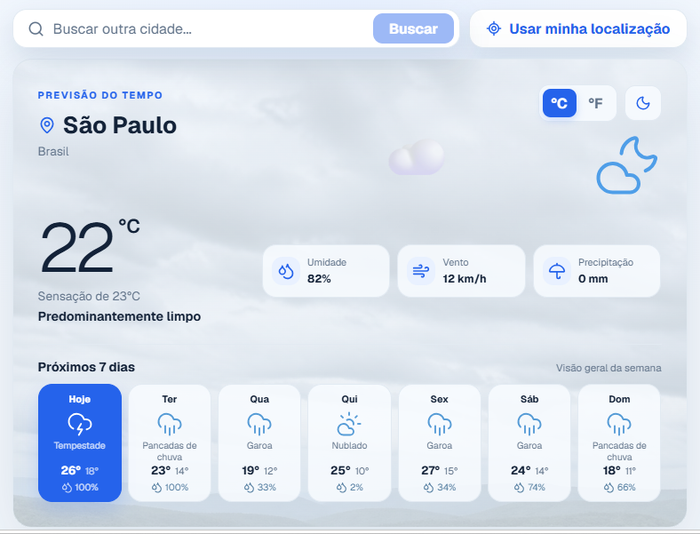

# Weather Dashboard

Painel responsivo de previsão do tempo desenvolvido como teste técnico frontend. A aplicação utiliza Next.js, TypeScript, React Query e a API Open-Meteo para apresentar as condições atuais e a previsão dos próximos sete dias.

## Demonstração

## Céu limpo 



## Tempo nublado 


## Funcionalidades

- Exibição das condições meteorológicas atuais.
- Previsão para os próximos sete dias.
- Busca e seleção de cidades.
- Uso da localização atual do navegador.
- Alternância entre Celsius e Fahrenheit.
- Tema claro e escuro com preferência salva no navegador.
- Paisagens que mudam conforme o clima atual.
- Animações para sol, nuvens e chuva.
- Interface responsiva para desktop e dispositivos móveis.


## Tecnologias

- [Next.js](https://nextjs.org/)
- [React](https://react.dev/)
- [TypeScript](https://www.typescriptlang.org/)
- [TanStack React Query](https://tanstack.com/query/latest)
- [Lucide React](https://lucide.dev/)
- [Vitest](https://vitest.dev/)
- [Testing Library](https://testing-library.com/)
- CSS Modules

## API

Os dados são obtidos gratuitamente pela [Open-Meteo](https://open-meteo.com/):

- Forecast API para condições atuais e previsão diária.
- Geocoding API para pesquisa de cidades.
- Não é necessária uma chave de API.

## Organização do projeto

```text
src/
├── app/          # Rotas, layout e estilos globais
├── components/   # Componentes visuais e interativos
├── hooks/        # Consultas com React Query
├── providers/    # Providers globais da aplicação
├── services/     # Comunicação com a API Open-Meteo
├── test/         # Configuração do ambiente de testes
├── types/        # Tipagens dos dados meteorológicos
└── utils/        # Conversão dos códigos do clima
```

## Testes unitários

A suíte cobre serviços, hooks e componentes meteorológicos, incluindo chamadas às APIs, geolocalização, busca de cidades, temas, unidades de medida e estados do painel.

Resultado atual:

```text
Arquivos de teste: 7 aprovados
Testes:            59 aprovados
Statements:        100%
Branches:          95,72%
Functions:         100%
Lines:             100%
```

## Autor

Desenvolvido por [Osmar André](https://github.com/oavandre).
